```python
import numpy as np # linear algebra
import pandas as pd # data processing, CSV file I/O (e.g. pd.read_csv)

# Input data files are available in the read-only "../input/" directory
# For example, running this (by clicking run or pressing Shift+Enter) will list all files under the input directory

import os
for dirname, _, filenames in os.walk('/kaggle/input'):
    for filename in filenames:
        print(os.path.join(dirname, filename))

```

    /kaggle/input/sample-sales-data/sales_data_sample.csv


```python
import pandas as pd
import numpy as np
import matplotlib.pyplot as plt
import seaborn as sns
from sklearn.preprocessing import StandardScaler
from sklearn.cluster import KMeans
from scipy.cluster.hierarchy import dendrogram, linkage
from sklearn.cluster import AgglomerativeClustering
import warnings
warnings.filterwarnings("ignore", category=FutureWarning)
warnings.filterwarnings("ignore", category=UserWarning)
df = pd.read_csv("/kaggle/input/sample-sales-data/sales_data_sample.csv", encoding='latin1')
```


```python
df.head()
```


<div>
<style scoped>
    .dataframe tbody tr th:only-of-type {
        vertical-align: middle;
    }

    .dataframe tbody tr th {
        vertical-align: top;
    }

    .dataframe thead th {
        text-align: right;
    }
</style>
<table border="1" class="dataframe">
  <thead>
    <tr style="text-align: right;">
      <th></th>
      <th>ORDERNUMBER</th>
      <th>QUANTITYORDERED</th>
      <th>PRICEEACH</th>
      <th>ORDERLINENUMBER</th>
      <th>SALES</th>
      <th>ORDERDATE</th>
      <th>STATUS</th>
      <th>QTR_ID</th>
      <th>MONTH_ID</th>
      <th>YEAR_ID</th>
      <th>...</th>
      <th>ADDRESSLINE1</th>
      <th>ADDRESSLINE2</th>
      <th>CITY</th>
      <th>STATE</th>
      <th>POSTALCODE</th>
      <th>COUNTRY</th>
      <th>TERRITORY</th>
      <th>CONTACTLASTNAME</th>
      <th>CONTACTFIRSTNAME</th>
      <th>DEALSIZE</th>
    </tr>
  </thead>
  <tbody>
    <tr>
      <th>0</th>
      <td>10107</td>
      <td>30</td>
      <td>95.70</td>
      <td>2</td>
      <td>2871.00</td>
      <td>2/24/2003 0:00</td>
      <td>Shipped</td>
      <td>1</td>
      <td>2</td>
      <td>2003</td>
      <td>...</td>
      <td>897 Long Airport Avenue</td>
      <td>NaN</td>
      <td>NYC</td>
      <td>NY</td>
      <td>10022</td>
      <td>USA</td>
      <td>NaN</td>
      <td>Yu</td>
      <td>Kwai</td>
      <td>Small</td>
    </tr>
    <tr>
      <th>1</th>
      <td>10121</td>
      <td>34</td>
      <td>81.35</td>
      <td>5</td>
      <td>2765.90</td>
      <td>5/7/2003 0:00</td>
      <td>Shipped</td>
      <td>2</td>
      <td>5</td>
      <td>2003</td>
      <td>...</td>
      <td>59 rue de l'Abbaye</td>
      <td>NaN</td>
      <td>Reims</td>
      <td>NaN</td>
      <td>51100</td>
      <td>France</td>
      <td>EMEA</td>
      <td>Henriot</td>
      <td>Paul</td>
      <td>Small</td>
    </tr>
    <tr>
      <th>2</th>
      <td>10134</td>
      <td>41</td>
      <td>94.74</td>
      <td>2</td>
      <td>3884.34</td>
      <td>7/1/2003 0:00</td>
      <td>Shipped</td>
      <td>3</td>
      <td>7</td>
      <td>2003</td>
      <td>...</td>
      <td>27 rue du Colonel Pierre Avia</td>
      <td>NaN</td>
      <td>Paris</td>
      <td>NaN</td>
      <td>75508</td>
      <td>France</td>
      <td>EMEA</td>
      <td>Da Cunha</td>
      <td>Daniel</td>
      <td>Medium</td>
    </tr>
    <tr>
      <th>3</th>
      <td>10145</td>
      <td>45</td>
      <td>83.26</td>
      <td>6</td>
      <td>3746.70</td>
      <td>8/25/2003 0:00</td>
      <td>Shipped</td>
      <td>3</td>
      <td>8</td>
      <td>2003</td>
      <td>...</td>
      <td>78934 Hillside Dr.</td>
      <td>NaN</td>
      <td>Pasadena</td>
      <td>CA</td>
      <td>90003</td>
      <td>USA</td>
      <td>NaN</td>
      <td>Young</td>
      <td>Julie</td>
      <td>Medium</td>
    </tr>
    <tr>
      <th>4</th>
      <td>10159</td>
      <td>49</td>
      <td>100.00</td>
      <td>14</td>
      <td>5205.27</td>
      <td>10/10/2003 0:00</td>
      <td>Shipped</td>
      <td>4</td>
      <td>10</td>
      <td>2003</td>
      <td>...</td>
      <td>7734 Strong St.</td>
      <td>NaN</td>
      <td>San Francisco</td>
      <td>CA</td>
      <td>NaN</td>
      <td>USA</td>
      <td>NaN</td>
      <td>Brown</td>
      <td>Julie</td>
      <td>Medium</td>
    </tr>
  </tbody>
</table>
<p>5 rows × 25 columns</p>
</div>


```python
df.info()
```

    <class 'pandas.core.frame.DataFrame'>
    RangeIndex: 2823 entries, 0 to 2822
    Data columns (total 25 columns):
     #   Column            Non-Null Count  Dtype  
    ---  ------            --------------  -----  
     0   ORDERNUMBER       2823 non-null   int64  
     1   QUANTITYORDERED   2823 non-null   int64  
     2   PRICEEACH         2823 non-null   float64
     3   ORDERLINENUMBER   2823 non-null   int64  
     4   SALES             2823 non-null   float64
     5   ORDERDATE         2823 non-null   object 
     6   STATUS            2823 non-null   object 
     7   QTR_ID            2823 non-null   int64  
     8   MONTH_ID          2823 non-null   int64  
     9   YEAR_ID           2823 non-null   int64  
     10  PRODUCTLINE       2823 non-null   object 
     11  MSRP              2823 non-null   int64  
     12  PRODUCTCODE       2823 non-null   object 
     13  CUSTOMERNAME      2823 non-null   object 
     14  PHONE             2823 non-null   object 
     15  ADDRESSLINE1      2823 non-null   object 
     16  ADDRESSLINE2      302 non-null    object 
     17  CITY              2823 non-null   object 
     18  STATE             1337 non-null   object 
     19  POSTALCODE        2747 non-null   object 
     20  COUNTRY           2823 non-null   object 
     21  TERRITORY         1749 non-null   object 
     22  CONTACTLASTNAME   2823 non-null   object 
     23  CONTACTFIRSTNAME  2823 non-null   object 
     24  DEALSIZE          2823 non-null   object 
    dtypes: float64(2), int64(7), object(16)
    memory usage: 551.5+ KB


```python
df.isnull().sum()
```


    ORDERNUMBER            0
    QUANTITYORDERED        0
    PRICEEACH              0
    ORDERLINENUMBER        0
    SALES                  0
    ORDERDATE              0
    STATUS                 0
    QTR_ID                 0
    MONTH_ID               0
    YEAR_ID                0
    PRODUCTLINE            0
    MSRP                   0
    PRODUCTCODE            0
    CUSTOMERNAME           0
    PHONE                  0
    ADDRESSLINE1           0
    ADDRESSLINE2        2521
    CITY                   0
    STATE               1486
    POSTALCODE            76
    COUNTRY                0
    TERRITORY           1074
    CONTACTLASTNAME        0
    CONTACTFIRSTNAME       0
    DEALSIZE               0
    dtype: int64


```python
plt.figure(figsize=(8,6))
sns.histplot(df['SALES'], kde=True, color='blue', bins=30)
plt.title('Sales Distribution')
plt.xlabel('Sales Amount')
plt.ylabel('Frequency')
plt.show()

```


    
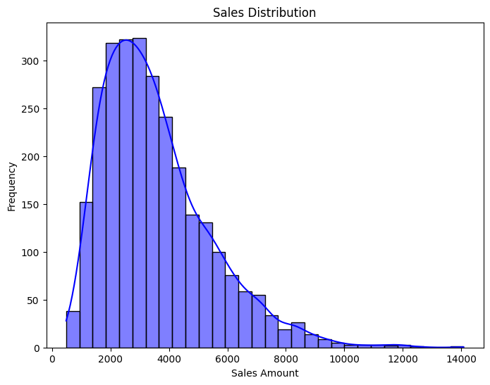
    


```python
plt.figure(figsize=(8,6))
sns.scatterplot(x='QUANTITYORDERED', y='SALES', data=df, hue='DEALSIZE', palette='coolwarm')
plt.title('Quantity Ordered vs Sales')
plt.xlabel('Quantity Ordered')
plt.ylabel('Sales')
plt.show()
```


    
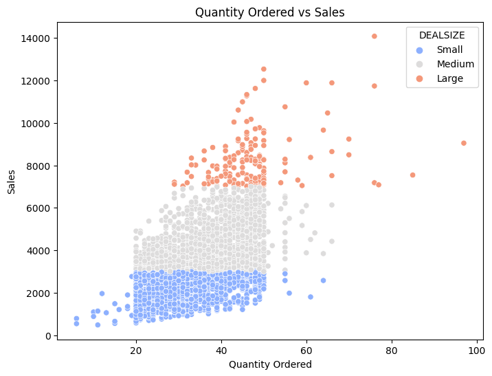
    


```python
plt.figure(figsize=(8,6))
sns.boxplot(x='PRICEEACH', data=df, color='lightcoral')
plt.title('Price Each Distribution')
plt.xlabel('Price Each')
plt.show()
```


    
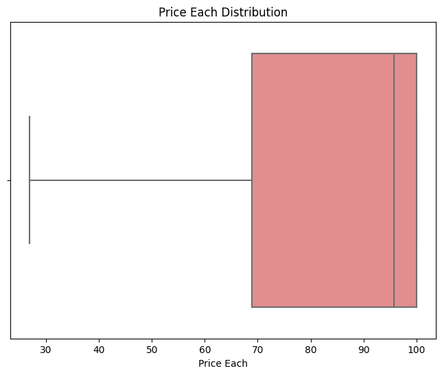
    


```python
plt.figure(figsize=(10,6))
sns.barplot(x='PRODUCTLINE', y='SALES', data=df, estimator=sum, ci=None, palette='viridis')
plt.title('Total Sales per Product Line')
plt.xticks(rotation=45)
plt.ylabel('Total Sales')
plt.show()
```


    
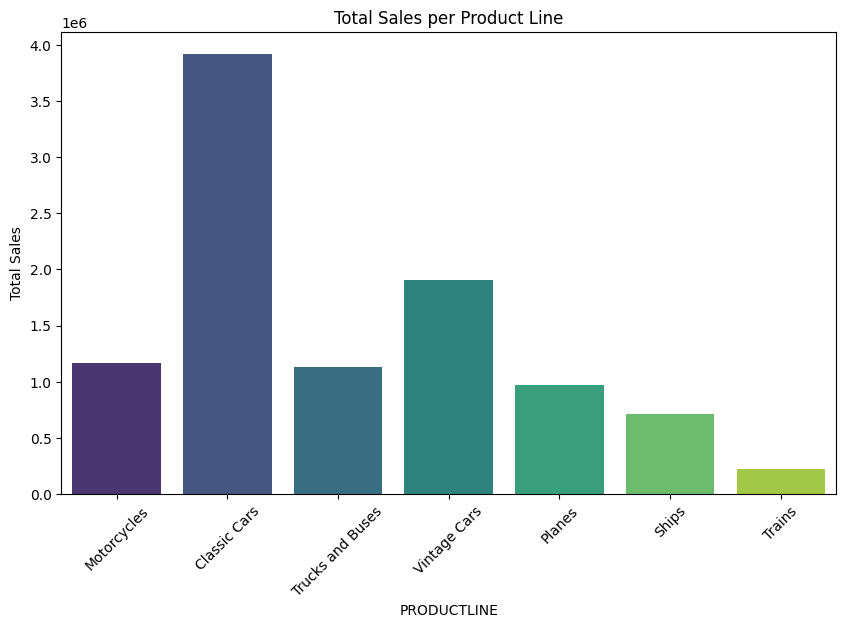
    


```python
plt.figure(figsize=(8,6))
sales_per_year = df.groupby('YEAR_ID')['SALES'].sum().reset_index()
sns.lineplot(x='YEAR_ID', y='SALES', data=sales_per_year, marker='o', color='dodgerblue')
plt.title('Yearly Sales Trend')
plt.xlabel('Year')
plt.ylabel('Total Sales')
plt.show()
```


    
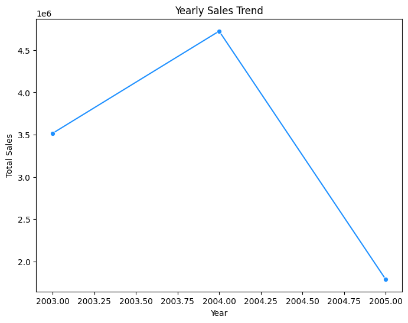
    


```python
plt.figure(figsize=(8,6))
sns.boxplot(x='DEALSIZE', y='SALES', data=df, palette='Set2')
plt.title('Deal Size Impact on Sales')
plt.xlabel('Deal Size')
plt.ylabel('Sales')
plt.show()
```


    
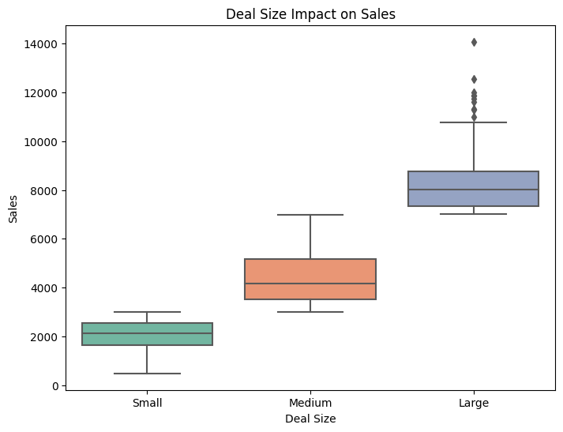
    


```python
plt.figure(figsize=(12,6))
top_countries = df.groupby('COUNTRY')['SALES'].sum().nlargest(10).reset_index()
sns.barplot(x='COUNTRY', y='SALES', data=top_countries, palette='magma')
plt.title('Top 10 Countries by Total Sales')
plt.xticks(rotation=45)
plt.ylabel('Total Sales')
plt.show()
```


    
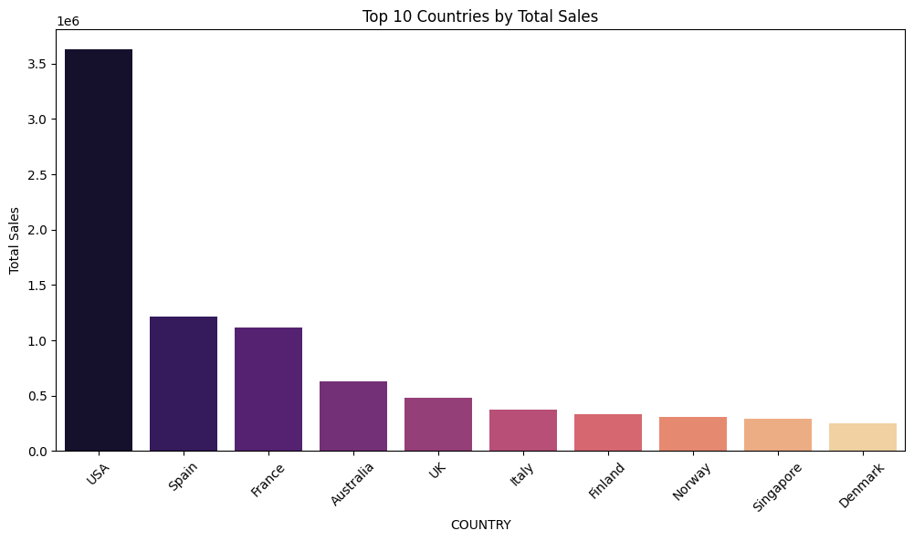
    


```python
# Select numerical features for clustering
features = ['QUANTITYORDERED', 'PRICEEACH', 'SALES', 'MSRP']
X = df[features]
```


```python
# Handle missing values (if any)
X = X.dropna()

# Standardize the data
scaler = StandardScaler()
X_scaled = scaler.fit_transform(X)

```


```python
# Calculate WCSS for different cluster sizes
wcss = []
for i in range(1, 11):
    kmeans = KMeans(n_clusters=i, random_state=42)
    kmeans.fit(X_scaled)
    wcss.append(kmeans.inertia_)

# Plot the Elbow Curve
plt.figure(figsize=(8, 5))
plt.plot(range(1, 11), wcss, marker='o')
plt.title('Elbow Method for Optimal k')
plt.xlabel('Number of clusters')
plt.ylabel('WCSS')
plt.show()
```


    
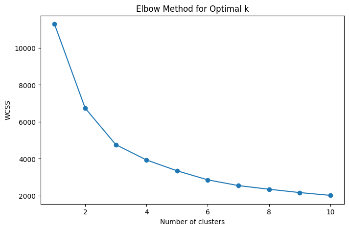
    


```python
# Choose k based on the elbow method, e.g., k=3
kmeans = KMeans(n_clusters=3, random_state=42)
clusters = kmeans.fit_predict(X_scaled)

# Add the cluster labels to the original dataframe
df['Cluster'] = clusters

# Visualize the clusters
plt.figure(figsize=(8, 6))
sns.scatterplot(x=X_scaled[:, 0], y=X_scaled[:, 1], hue=clusters, palette='Set1')
plt.title('K-Means Clustering Results')
plt.show()

```


    
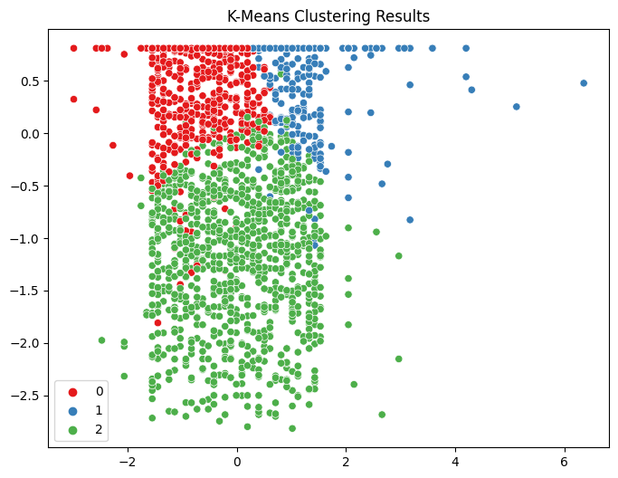
    


```python
# Generate linkage matrix using the 'ward' method
linked = linkage(X_scaled, method='ward')

# Plot the dendrogram
plt.figure(figsize=(10, 7))
dendrogram(linked)
plt.title('Dendrogram for Hierarchical Clustering')
plt.xlabel('Samples')
plt.ylabel('Distance')
plt.show()

```


    
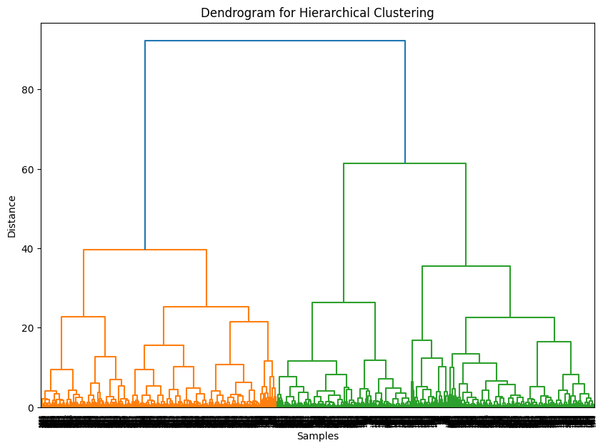
    


```python
# Choose the number of clusters, e.g., 3
hierarchical_clustering = AgglomerativeClustering(n_clusters=3, affinity='euclidean', linkage='ward')
hc_clusters = hierarchical_clustering.fit_predict(X_scaled)

# Add the cluster labels to the original dataframe
df['HC_Cluster'] = hc_clusters

# Visualize the clusters
plt.figure(figsize=(8, 6))
sns.scatterplot(x=X_scaled[:, 0], y=X_scaled[:, 1], hue=hc_clusters, palette='Set1')
plt.title('Hierarchical Clustering Results')
plt.show()

```


    
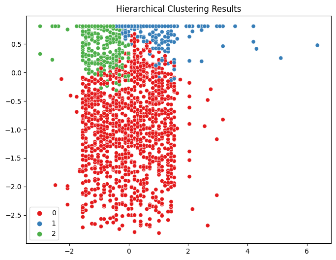
    


```python
# Inertia for K-Means
inertia = kmeans.inertia_
print(f'Inertia: {inertia}')

from sklearn.metrics import silhouette_score
# Silhouette Score for K-Means
kmeans_silhouette = silhouette_score(X_scaled, clusters)
print(f'Silhouette Score (K-Means): {kmeans_silhouette}')
# Silhouette Score for Hierarchical Clustering
hc_silhouette = silhouette_score(X_scaled, hc_clusters)
print(f'Silhouette Score (Hierarchical): {hc_silhouette}')

from sklearn.metrics import davies_bouldin_score
# Davies-Bouldin Index for K-Means
kmeans_dbi = davies_bouldin_score(X_scaled, clusters)
print(f'Davies-Bouldin Index (K-Means): {kmeans_dbi}')
# Davies-Bouldin Index for Hierarchical Clustering
hc_dbi = davies_bouldin_score(X_scaled, hc_clusters)
print(f'Davies-Bouldin Index (Hierarchical): {hc_dbi}')

from sklearn.metrics import calinski_harabasz_score
# Calinski-Harabasz Index for K-Means
kmeans_ch = calinski_harabasz_score(X_scaled, clusters)
print(f'Calinski-Harabasz Index (K-Means): {kmeans_ch}')
# Calinski-Harabasz Index for Hierarchical Clustering
hc_ch = calinski_harabasz_score(X_scaled, hc_clusters)
print(f'Calinski-Harabasz Index (Hierarchical): {hc_ch}')
```

    Inertia: 4766.017133863959
    Silhouette Score (K-Means): 0.3504523735351092
    Silhouette Score (Hierarchical): 0.31527494740967016
    Davies-Bouldin Index (K-Means): 1.0091895570978797
    Davies-Bouldin Index (Hierarchical): 0.9888199869306714
    Calinski-Harabasz Index (K-Means): 1930.6761983442068
    Calinski-Harabasz Index (Hierarchical): 1672.3553032169289

